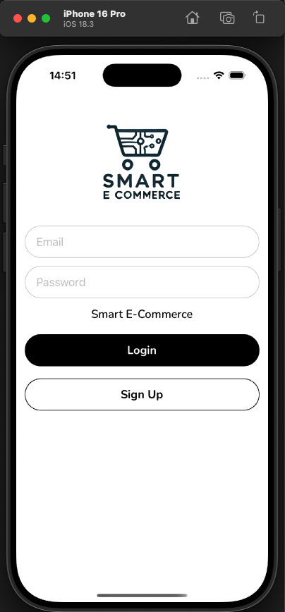
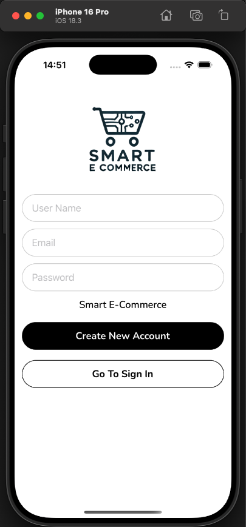
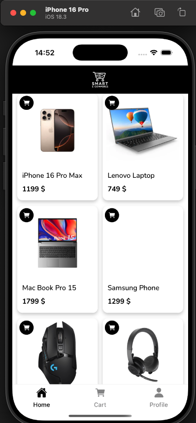
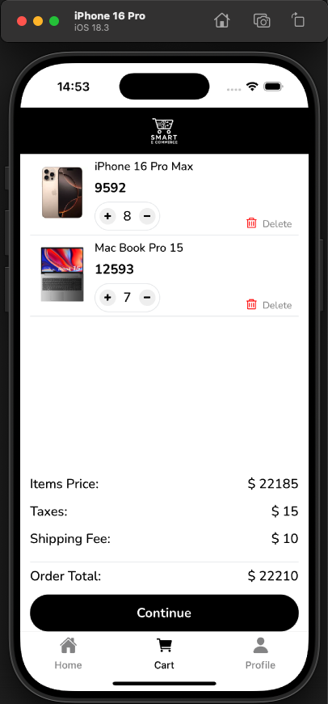
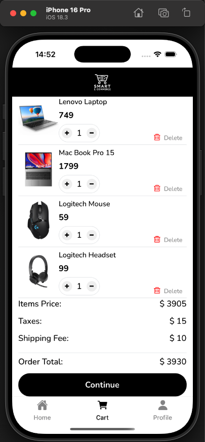
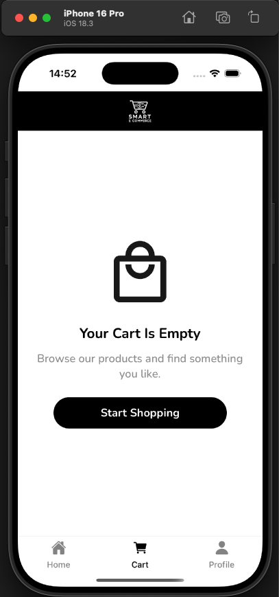
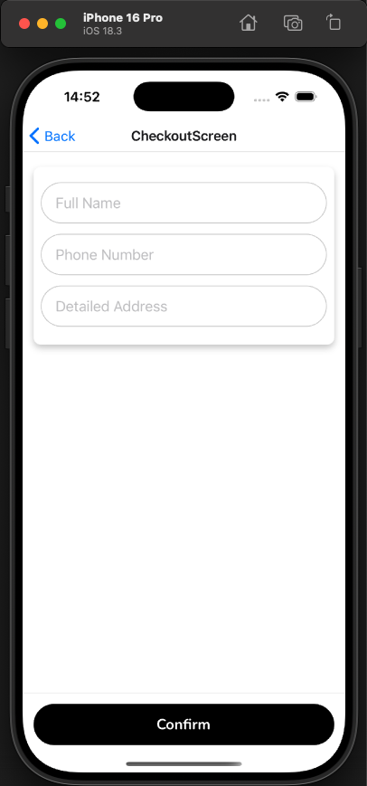
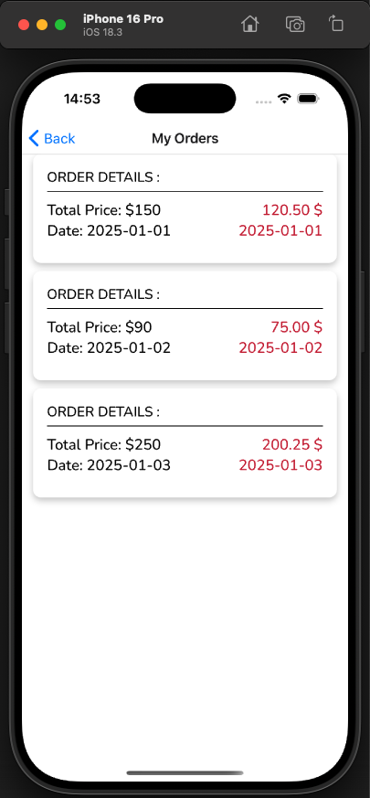

# 🛒 Smart E-Commerce (React Native)

This project was built as part of a React Native learning course.  
The goal of the project is to practice essential mobile development concepts such as navigation, reusable components, state management with Redux Toolkit, custom UI building, and implementing a basic e-commerce flow.

It includes authentication screens, product listing, a functional cart, and global state logic—all implemented step by step as part of the learning process.

---

## ✨ Features

- 🔐 **Authentication flow**
    - Sign In screen
    - Sign Up screen

- 🧭 **Multi-screen navigation**
    - Stack Navigation
    - Bottom Tab Navigation

- 🛍️ **Product listing**
    - Product cards
    - Add to cart button
    - Custom UI elements
    - Shadow & styled layout

- 🛒 **Cart system**
    - Add / remove items
    - Increase / decrease quantity
    - Delete product
    - Automatic total calculation
    - Empty cart state

- 🧱 **Reusable components**
    - Buttons, headers, inputs
    - Custom fonts
    - Props & component composition

- 🛢️ **Redux Toolkit global state management**
    - Store setup
    - cartSlice (reducers + actions)

---

## 🧱 Tech Stack

- **React Native**
- **Expo**
- **React Navigation**
    - Native Stack
    - Bottom Tabs
- **Redux Toolkit** (Slices, Actions, Store)
- **Custom Components & Props**
- **FlatList rendering**
- **Custom Fonts & Icons**

---

## ▶️ Getting Started

Clone the repository:

bash
git clone https://github.com/kandyba/smart-e-commerce.git

cd smart-e-commerce
npm install

expo start

## 📸 App Preview

### 🔐 Authentication
**Sign In**  

**Sign Up**  

---

### 🏬 Product Listing

---

### 🛒 Cart
**Cart With Multiple Items**  

**Cart Example #2**  

**Empty Cart**  

---

### 🧾 Checkout

---

### 📦 My Orders

